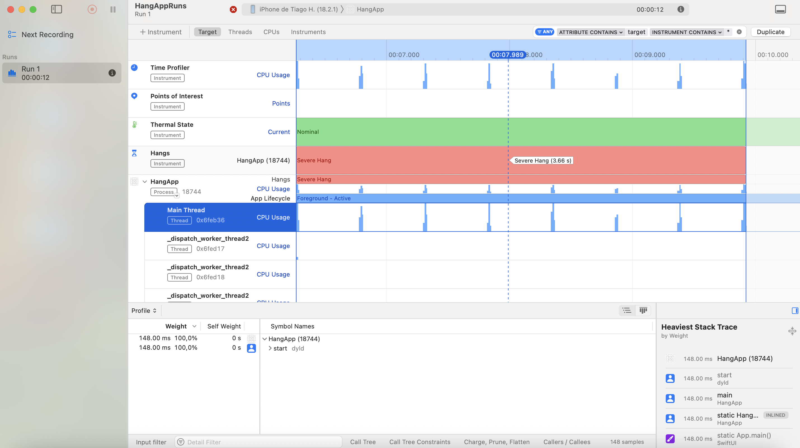

# Hang App

Hi! 👋

This is the sample app for the issue #59: [👮‍♂️ Identifying a Hang in iOS Applications 😰](https://www.ioscoffeebreak.com/issue/issue59) of the iOS Coffee Break Newsletter, that showcases a common performance challenge in iOS apps: UI hangs caused by intensive tasks running on the main thread.

 

  

Have a nice day,
 
Tiago Henriques
